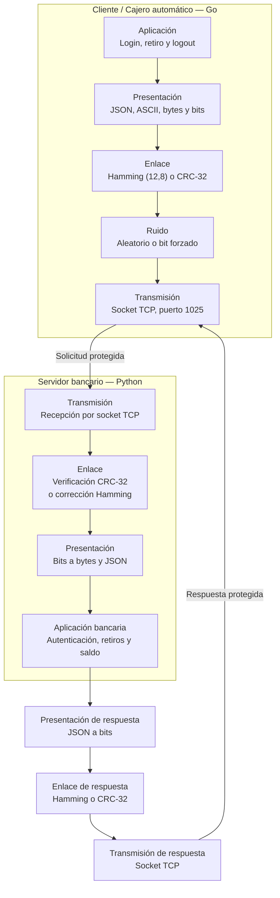

# Laboratorio 2 - Comunicación protegida

Cliente/cajero en Go y servidor bancario en Python comunicados por TCP en
`127.0.0.1:1025`. Las tramas de aplicación son JSON delimitado por salto de
línea; la carga útil es otro JSON convertido a ASCII, bits y código de enlace.

## Arquitectura

```text
Go: aplicación -> presentación (ASCII/bits) -> enlace -> ruido -> TCP
Python: TCP -> ruido recibido -> enlace -> presentación -> aplicación bancaria
Python: aplicación -> presentación -> enlace -> ruido de respuesta -> TCP
Go: TCP -> enlace -> presentación -> resultado
```



La respuesta también es una trama protegida. Su envelope tiene esta forma:

```json
{
  "action": "frame_result",
  "data": {
    "algorithm": "HAMMING",
    "frame": "010101...",
    "original_bit_length": 123,
    "metadata": {"status_before_encoding": "ok"}
  }
}
```

La solicitud usa `action: "send_frame"`, el mismo `algorithm`, `frame`,
`original_bit_length` y metadatos de ruido. Los JSON externos siempre terminan
en `\n`.

## Códigos

- Hamming(12,8): cada byte se codifica en un bloque de 12 bits. Las posiciones
  1, 2, 4 y 8 son paridad par; las posiciones se cuentan de izquierda a
  derecha desde 1. Cada bloque corrige un error. Varios errores en un bloque
  pueden producir una corrección incorrecta.
- CRC-32: se agrega el residuo de división módulo 2 usando exactamente
  `100000100110000010001110110110111`. Detecta errores, pero no los corrige;
  una respuesta rechazada no se recupera automáticamente.

## Ejecución

Terminal 1:

```text
cd server
python server1.py
```

Terminal 2:

```text
cd client_go
go run .
```

En el menú manual se pueden enviar `login`, `withdraw`, `logout` o un mensaje
de prueba, seleccionar Hamming/CRC32 y aplicar ruido nulo, aleatorio o un bit
forzado. La cuenta demostrativa es tarjeta `221645`, PIN `1234`, saldo inicial
500. El servidor valida sesión, monto positivo, formato numérico y fondos.

La matriz automática conserva 800 transmisiones (dos algoritmos, cuatro
tamaños, cinco probabilidades y veinte repeticiones). Los resultados se
agregan a `client_go/resultados.csv`; se incluyen campos de solicitud y
respuesta, estados, bits alterados y `round_trip_ms`.

## Pruebas y observación

```text
cd client_go
go test ./...
cd ..\tests_python
python plot_results.py
```

El proyecto no requiere dependencias externas para cliente o servidor. El
script de gráficas requiere las dependencias de `requirements.txt`.

Para observar el tráfico en Wireshark puede usarse:

```text
tcp.port == 1025
```

Las alteraciones son simuladas en la aplicación antes/después de TCP; TCP no
se modifica. Hamming solo ofrece corrección por bloque y CRC32 solo detección.
